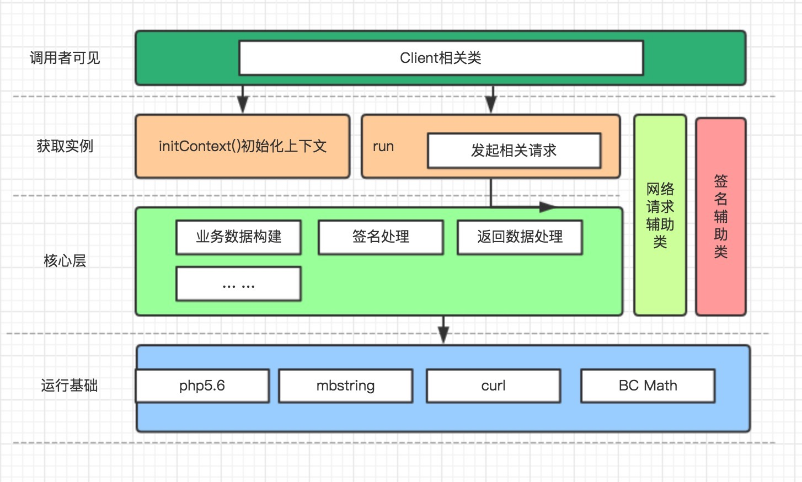
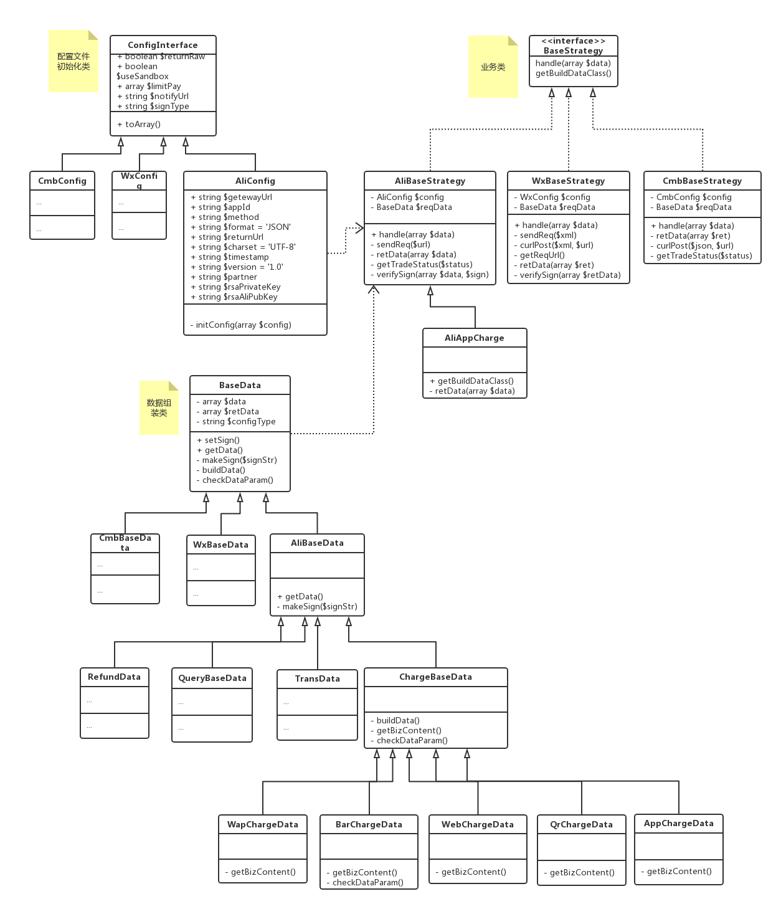

## 代码说明

为了让大家快速理解代码结构，将项目相关结构图进行说明，这里从调用者的角度出发进行描述

这张图表现的是库的一个层次。用支付宝手机wap支付为例：

调用这只需要通过

`Charge::run()`

这个方法即可完成所有调用。剩下的所有东西对调用者都应该是透明的

这个方法内部会首先通过

`ChargeContext::initCharge()`

进行上下文的初始化，完成准备工作，并返回一个具体的对应支付实例，在这里是：`AliAppCharge`

接着内部会调用

`AliAppCharge::charge()`

完成支付的请求，他会把结果返回给调用者

在 `AliAppCharge::charge()` 调用中完成了请求数据的组装，请求数据的签名，如果需要网络请求，会发送网络请求到支付宝网关。并把结果逐步返回。

## 核心类图

本库的所有功能，层次结构比较一致。这里以支付宝app支付为例，进行一下类图描述，方便大家以此进行类比

